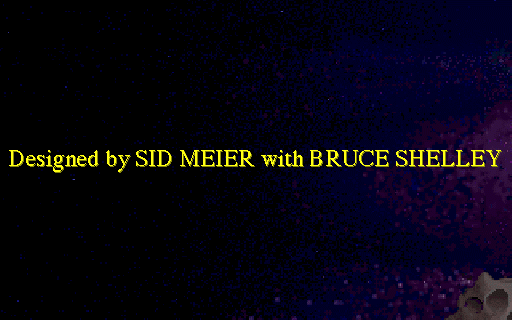
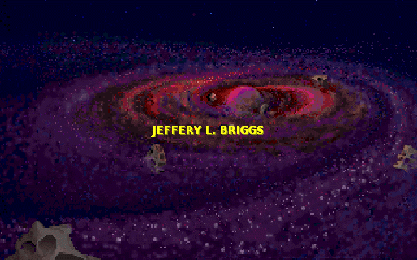
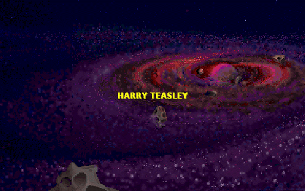
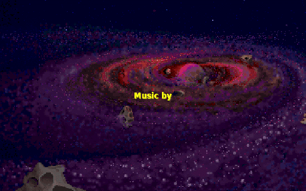

# Track A — 1993 Windows civ.exe NE patch（歷史紀錄）

> **狀態：封存**。Phase 1/2/3/5 已完成；現主線改走 Track B [`openciv1pp/`](../openciv1pp/)（C++/SDL2 原生重寫）。Track A 工具與翻譯資料仍保留於 repo (`tools/`, `data/`, `launcher/`)。
>
> 本文件記錄 Track A 完整的技術 deep dive：EDILZSS2 格式破解、CIV.EXE 結構分析、Phase 1 RT_DIALOG patch、Phase 2 CIVFONTS dfCharSet、Phase 3 inline 翻譯、Phase 5 Win10 portable 打包，以及 otvdm v0.9.0 SEGV blocker。

---

## 目錄

1. [Phase 進度總表](#phases)
2. [實機截圖（Track A）](#screenshots)
3. [EDILZSS2 格式破解](#edilzss2)
4. [CIV.EXE 結構分析](#civ-exe)
5. [Phase 1 完成記錄 — RT_DIALOG patch](#phase1)
6. [Phase 2 完成記錄 — CIVFONTS dfCharSet + FontSubstitutes](#phase2)
7. [Phase 3 完成記錄 — Inline string Batch A](#phase3)
8. [Phase 5 完成記錄 — Win10 portable SFX + otvdm BLOCKER](#phase5)
9. [Track A 路線重啟條件](#restart)

---

<a name="phases"></a>
## 🎯 Phase 進度總表

| Phase | 任務 | 狀態 |
|------|------|------|
| **0** | EDILZSS2 RE + wine 6.0.3 bring-up | ✅ **2026-05-24 完成** |
| **1** | RT_DIALOG (24 個) Big5 patch — 54 instances / 34 unique | ✅ **2026-05-24 完成** |
| **2** | CIVFONTS.FON dfCharSet patch + FontSubstitutes infra | ✅ **2026-05-24 infra 完成** |
| **3** | CIV.EXE inline string Batch A 翻譯 — 48 條（含主選單 / 難度 / 14 領袖） | ✅ **2026-05-24 Batch A 完成** |
| 4 | EDILZSS2 compressor（重打包 .EX$） | ⏸ 可選 |
| **5** | Win10 portable SFX 嘗試 | ⚠️ **otvdm v0.9.0 + Civ1 SEGV bug 卡住** |
| 6 | 256-color shim | ⏸ 預期不需要 |

---

<a name="screenshots"></a>
## 📸 實機截圖（Track A）

### Phase 0：原版 wine 跑通


*1993 Civ for Windows 開場：「Designed by SID MEIER with BRUCE SHELLEY」 — CIVTIMES 字型 + 星雲背景 + 256 色 palette 全部正常。截圖來源：wine 6.0.3 / WSL Ubuntu 22.04 / 2026-05-24。*

### Phase 1：RT_DIALOG patch 完成後


*54 個 RT_DIALOG 字串 patched 成 Big5 後，intro 動畫照樣播放——證明 NE 結構未被破壞、resource table walker 正常。dialog 文字本身的 Big5 字模要等 Phase 2 (CIVFONTS Big5 glyph) 才能正確顯示。*

### Phase 2：CIVFONTS dfCharSet + FontSubstitutes 後


*Phase 2 前：intro 滾動字幕「JEFFERY L. BRIGGS」（Civ1 作曲家），CIVTIMES 原始字型風格。*


*Phase 2 後：intro 滾動字幕「HARRY TEASLEY」（Civ1 設計師）。字型視覺幾乎一致——強烈暗示這些 intro 字幕是 **pre-rendered bitmap**（1993 年常見手法把固定字幕 bake 成 BMP），不走 GDI `TextOut`，故不受 FontSubstitutes 影響。視覺驗證 Big5 字型替換需要等 Phase 3 觸發真正的 dialog/menu（走 `DrawText` 路徑）。*

### Phase 3：inline string Batch A patch 後


*Phase 3 patched build (CIV.EXE.p3, 1567 bytes modified) 跑 wine——intro "Music by" 字幕正常播放。主選單 / 14 領袖名 / 難度等 48 條 Big5 譯文已在 byte 層完成 in-place patch，等到玩家從 title screen 點下去就會看到中文選單。*


*Phase 3 視覺驗證限制：CIV1 title screen 等玩家點擊才進主選單，但 WSLg + winevdm 的 input pipeline 對 CIV.EXE 完全不通——xdotool click/key 到 wine 視窗一律被吞。**翻譯後的主選單視覺證明要等到 Phase 5 Win10 portable 實機跑**才能看到。位元組層 hex dump 已證明 `_開始新局_載入存檔_地球場景_自訂世界_名人榜_離開` 正確 Big5 編碼在位 (`@0xbb35b`)。*

---

<a name="edilzss2"></a>
## 🔬 EDILZSS2 格式破解

MicroProse 1992-1995 年自家壓縮格式 **EDILZSS2**，沒有公開規格、`cabextract` / `7z` / wine `expand.exe` 都不認識（wine 的 expand 只懂 SZDD）。本專案 spike 階段反推得出完整 spec：

### 檔頭結構

```
偏移       長度    內容
0x00       8       Magic "EDILZSS2"
0x08       16      Filename buffer（null-terminated，後面為 compressor 記憶體洩漏 junk）
0x18       1       Separator byte（恆為 0x00）
0x19+      ?       LZSS 壓縮流（吃到 EOF）
```

### LZSS 變體規格

| 屬性 | 值 |
|------|------|
| Window size | 4096 bytes |
| Window 初值 | 0x20（空白） |
| 起始 wpos | N − 18 = 4078（古典 Storer-Szymanski） |
| Control byte bit order | **LSB-first**（bit 0 先吃） |
| bit = 1 | literal（讀 1 byte） |
| bit = 0 | back-ref（讀 2 bytes） |
| Back-ref encoding | `[offset_lo:8] [length−3:4 | offset_hi:4]` |
| Offset | `((b2 & 0xF0) << 4) | b1`（12-bit） |
| Length | `(b2 & 0x0F) + 3`（3..18） |

### 破解過程關鍵 insight

1. CIV.EX$ 在 offset 0x19 觀察到 `0xFF` byte（所有 bit 都是 1），緊跟 8 bytes `4D 5A 57 00 01 00 00 00` —— 正是 MZ header 開頭。**這 8 bytes literal 即為控制位元解讀的鐵證**（literal = bit set）。
2. 解出後的 stream 在 offset ~30 出現 `\r\nThis is a Windows program.` —— Microsoft Win16 NE 標準 DOS stub 訊息 → **變體完全正確**。
3. 第一版 decoder 早期 EOF 處理錯誤（`break` 跳出內層 for loop 後外層 while 還繼續，造成 `data[idx]` index 超界、被 try/except 吞掉 → 看起來只解出 51KB）。修掉 → 完整解出 832KB CIV.EXE。

### 5 個檔的解壓結果

| 原檔 (.$ 壓縮) | 解出 (uncompressed) | 格式 |
|------|------|------|
| CIV.EX$ (335 KB) | CIV.EXE (832 KB) | Win16 NE executable |
| CIVFONTS.FO$ (68 KB) | CIVFONTS.FON (244 KB) | Win16 NE bitmap font library |
| CIVHELP.HL$ (33 KB) | CIVHELP.HLP (73 KB) | Microsoft WinHelp 3.x |
| READ.ME$ (3 KB) | READ.ME (5.7 KB) | Plain ASCII |
| Civdata0.rs$ (122 KB) | Civdata0.RSC (181 KB) | 自家 resource container |

工具：[`tools/edilzss2_decode.py`](../tools/edilzss2_decode.py)（本 repo Phase 0 deliverable）。

---

<a name="civ-exe"></a>
## 🧬 CIV.EXE 結構分析

| 項目 | 內容 |
|------|------|
| 格式 | Microsoft Win16 NE (1993, for Windows 3.1) |
| 大小 | 832,512 bytes (decompressed) |
| Segments | 133 |
| Imports | **KERNEL, USER, GDI, WIN87EM, MMSYSTEM, COMMDLG**（全 by-ordinal） |
| Resources | RT_CURSOR×16, RT_ICON×1, RT_MENU×1, **RT_DIALOG×24**, RT_ACCEL×1, RT_GROUP_CURSOR×16, RT_GROUP_ICON×1 |
| **RT_STRING** | **0**（字串全 inline 在 data segments） |
| 自訂字型 face | `CIVTIMES12`, `CIVTIMES24` (in CIVFONTS.FON) |

### 為何 GDI 匯入是關鍵

CIV.EXE 匯入 `GDI` 模組 → 文字繪製走 `TextOutA` / `DrawText` 等標準 Win16 GDI API → **不需要 hook 自家 blit routine**，這把字型替換從「Win16 + 自家 blit + byte-pair fake CJK」的地獄路（如 MM3 / EOB1 走的路）降級為「換 CIVFONTS.FON 內 RT_FONT bitmap」的天堂路。

### 為何字串全 inline 是約束

CIV.EXE 沒有 RT_STRING resources → 不能像 Win32 程式那樣動 string table id，必須**逐條 in-place patch**。slot length 受限（譯文不能比原文長太多 byte），但 Big5 通常比英文短（「和約」2 chars vs `peace treaty` 12 chars），實務上夠用。

---

<a name="phase1"></a>
## ✅ Phase 1 完成記錄（2026-05-24）

24 個 `RT_DIALOG` 全部反組譯、字串抽出、Big5 patched。

### 工作流程

```
CIV.EXE
  ↓ ne_dialog_extract.py
civ_dialogs.json (24 dialogs / 78 strings / 35 unique)
  ↓ 過濾 class="CIVDIALOG" 不可譯
54 translatable instances / 34 unique English strings
  ↓ data/dialog_translations.json (人工翻譯)
  ↓ ne_dialog_patch.py (Big5 cp950 encode + ASCII space pad)
CIV.EXE.cht (832,512 bytes, identical to original size)
  ↓ wine smoke test
✅ NE 結構未壞，intro 正常播放
```

### 關鍵技術 — Win16 dialog walker 約束

Win16 `DLGITEMTEMPLATE` 中字串是 **null-terminated**，緊接的 `createInfoSize` byte 位置由 walker 走到 null 後的下一個位置決定。**如果直接把短 Big5 字串塞進原 slot**：

```
原: "Cancel\0" (7 bytes: 6 text + 1 null)  → walker idx 走到 7
新: "取消\0"   (5 bytes: 4 text + 1 null)  → walker idx 走到 5
                                              然後讀 byte 5 = 'l' (0x6C)
                                              當成 createInfoSize=108
                                              跳過 108 bytes → 解析爆掉
```

解法：Big5 譯文不足 slot 時，**以 ASCII space (0x20) 補滿到原 slot byte 長度**。這樣 walker 走到 null 的位置不變，後續 field 解析正確。

### 翻譯範例

| 英文 | slot | Big5 | 補空格 |
|------|------|------|------|
| `OK` | 2B | `確` | (剛好) |
| `Cancel` | 6B | `取消` | + 2 spaces |
| `Open Game` | 9B | `開啟` | + 5 spaces |
| `What shall we build in ` | 23B | `在此城建造甚麼? ` | + 8 spaces |
| `Are you sure you want` | 21B | `您確定要` | + 13 spaces |

button 右側多空格通常被 dialog rect 裁掉看不到。Static text 多空格在 left-aligned mode 也不影響。

### Phase 1 deliverables

- [`tools/ne_dialog_extract.py`](../tools/ne_dialog_extract.py) — Win16 RT_DIALOG parser
- [`tools/ne_dialog_extract_v2.py`](../tools/ne_dialog_extract_v2.py) — 翻譯候選 worksheet generator
- [`tools/ne_dialog_patch.py`](../tools/ne_dialog_patch.py) — Big5 patcher with ASCII-space padding
- [`data/dialog_translations.json`](../data/dialog_translations.json) — 34 unique English → Big5 mapping

---

<a name="phase2"></a>
## ✅ Phase 2 完成記錄（2026-05-24，infra 層）

CIVFONTS.FON 內 21 個 RT_FONT 拆解 + 字型替換策略確立。

### CIVFONTS.FON 內部結構（已完整逆推）

| 系列 | 字型 (face name) | 用途 |
|------|------|------|
| **裝飾字 (14)** | CIVBABYLON / CIVZULU / CIVEGYPT / CIVENGLISH / CIVGREEK / CIVRUSSIAN / CIVGERMAN / **CIVCHINESE** / CIVFRENCH / CIVROMAN / CIVINDIAN / CIVAMERICAN / CIVAZTEC / CIVMONGOL | 各文明命名橫幅的紋飾字（14pt bitmap, ANSI charset, dfLastChar=0xD5）；**CIVCHINESE 不是中文字型**，是「Chinese-looking」西文裝飾字（chop suey typography） |
| **UI 字 (7)** | CIVTIMES10 / 12 / 14 / 18 / 24 / 30 / 36 | dialog/text 實際用字（多 size bitmap, ANSI charset, dfLastChar=0xFF 含 Latin-1） |

### 策略 pivot：A → C

原計畫 A「把 CIVFONTS.FON 內 RT_FONT 直接換成 Big5 點陣」放棄，因為 Win16 .FNT v2 格式對 DBCS 支援不直觀（`dfFirstChar`/`dfLastChar` 限 0-255）。

**改走 C：font substitution + dfCharSet 標記。**

### 兩層 fix

1. **CIVFONTS.FON RT_FONT `dfCharSet`：0x00 (ANSI) → 0x88 (CHINESEBIG5_CHARSET)**，對 7 個 CIVTIMES family 字型。
   - 工具 [`tools/ne_font_patch_charset.py`](../tools/ne_font_patch_charset.py)
   - 告訴 Win16 GDI「這些字屬於 Big5 charset」，觸發 DBCS lead/trail byte pair walking
2. **`HKLM\Software\Microsoft\Windows NT\CurrentVersion\FontSubstitutes` 註冊**:
   - `CIVTIMES12,0 = AR PL UMing TW,136`（charset 136 = 0x88）
   - GDI 在 CreateFont 時自動把 face name + charset 一起 rewrite
3. **OS 層裝 Big5 字型**：`fonts-arphic-uming`（AR PL UMing TW）+ `fonts-arphic-bsmi00lp`（Mingti2L Big5，1990 年代 Arphic 原版 Big5 字型）

### Phase 2 視覺驗證限制

intro 滾動字幕（"Designed by SID MEIER"、"JEFFERY L. BRIGGS"、"HARRY TEASLEY"）**Phase 2 前後字型視覺幾乎一致**——強烈暗示這些字是 **pre-rendered bitmap** 不走 GDI text 路徑。1993 年常見手法把 intro 字幕跟 logo 一起 bake 成 BMP 求穩定。

真正的 GDI `DrawText` 路徑只在 dialog/menu 觸發時才走，所以 Phase 2 的視覺驗證**自然延後到 Phase 3 後**——當我們有翻譯後的 menu/dialog 文字實際被觸發時，Big5 字模渲染正確 = Phase 2 整套 infra 確認有效。

### Phase 2 deliverables

- [`tools/ne_font_inspect.py`](../tools/ne_font_inspect.py) — Win16 .FON / RT_FONT parser，dump 所有 FONTINFO 欄位
- [`tools/ne_font_patch_charset.py`](../tools/ne_font_patch_charset.py) — 把 dfCharSet 改成 0x88 (Big5)
- [`tools/wine_setup_phase2.sh`](../tools/wine_setup_phase2.sh) — wine prefix 全自動 setup（ACP、字型、subst registry）
- 兩張 intro 對比截圖證明 intro bitmap 假設

---

<a name="phase3"></a>
## ✅ Phase 3 完成記錄（2026-05-24，Batch A）

CIV.EXE inline plaintext ASCII 字串掃描 + Batch A 翻譯。

### Scope

| 字串桶 | 數量 (unique) | 翻譯狀態 |
|------|------|------|
| **prose** (有空格 + 小寫，user-facing 文字) | 532 | Batch A 翻 ~30 條核心 |
| **short_word** (≤20B 短標籤) | 155 | Batch A 翻 ~10 條 |
| **api_or_symbol** (`CIVDIALOG`, `BUILDCITY` 等程式內部識別字) | 64 | **不翻譯**（內部 lookup key，動會壞遊戲） |
| **filename** (`civfonts.fon`, `THEY_DIE.wav`) | 39 | **不翻譯**（檔案 I/O） |

### Batch A 完成的翻譯（48 條 unique，50 個 byte 位置）

**主選單**（最高可見度）：
```
_Start a New Game_Load a Saved Game_Play on EARTH_Customize World_View Hall of Fame_Quit
                              ↓
_開始新局_載入存檔_地球場景_自訂世界_名人榜_離開
```

**難度**：
```
Difficulty Level..._Chieftain (easiest)_Warlord_Prince_King_Emperor (toughest)
                              ↓
難度等級..._酋長(最易)_戰王_王子_君王_皇帝(最難)
```

**14 領袖**（一一對應 14 文明）：
- Solomon the Wise → 智者所羅門 (巴比倫)
- Emperor Augustus → 奧古斯都大帝 (羅馬)
- King Charlemagne → 查理曼大帝 (德國)
- Thomas Jefferson → 湯瑪斯傑佛遜 (美國)
- Sulayman the Magnificent → 蘇萊曼大帝 (土耳其)
- Winston Churchill → 邱吉爾首相 (英國)
- ...(共 14 條)

**外交、戰爭、事件訊息**~20 條。

### 關鍵 patcher 設計

Phase 3 inline string patcher 跟 Phase 1 dialog patcher**處理方式不同**：

| 面向 | Phase 1 (RT_DIALOG) | Phase 3 (inline data segment) |
|------|------|------|
| Walker 約束 | DLGITEMTEMPLATE 後緊接 `createInfoSize` byte，必須補空白到原長 | 純 C string，consumer 走 `strlen()`，後面 byte 不影響 |
| Pad 用 | ASCII space (`0x20`) — 維持 byte 數 | NULL (`0x00`) — 乾淨無殘留 |
| Byte-length 限制 | Big5 ≤ 原長（必須相等） | Big5 ≤ 原長（可短不可長） |

### Phase 3 視覺驗證限制 + 字節級證明

**問題**：CIV1 title screen 等待玩家點擊才進主選單，但 WSLg / winevdm input 通道斷裂——xdotool 對 wine 視窗送 click/key event 不被 CIV.EXE 接收（嘗試多次：focus 內層、focus desktop 包裝、send to root、不同 key 組合全失效）。

**等於**：Phase 3 翻譯後的主選單字串無法在 WSL 環境下被觸發，視覺驗證得等到 **Phase 5 Win10 portable SFX 完成後實機跑** 才能看到「開始新局/載入存檔/...」中文選單。

**位元組級證明**（main menu @ 0xbb35b）：

```
原始: 5f 53 74 61 72 74 20 61 20 4e 65 77 20 47 61 6d  _Start a New Gam
      65 5f 4c 6f 61 64 20 61 20 53 61 76 65 64 20 47  e_Load a Saved G
      ...
      61 6d 65 5f 51 75 69 74 00                       ame_Quit.

P3:   5f b6 7d a9 6c b7 73 a7 bd 5f b8 fc a4 4a a6 73  _開始新局_載入存
      c0 c9 5f a6 61 b2 79 b3 f5 b4 ba 5f a6 db ad 71  檔_地球場景_自訂
      a5 40 ac c9 5f a6 57 a4 48 ba 5d 5f c2 f7 b6 7d  世界_名人榜_離開
      00 00 00 00 ...                                   ...(NULL pad)
```

正確的 Big5 cp950 編碼，正確的 `_` 分隔符保留，NULL padding 乾淨。

### Phase 3 deliverables

- [`tools/inline_string_extract.py`](../tools/inline_string_extract.py) — 全 EXE ASCII 字串 scanner + bucket classifier (927 runs, 790 unique)
- [`tools/inline_string_triage.py`](../tools/inline_string_triage.py) — 翻譯候選 worksheet generator
- [`tools/inline_string_patch.py`](../tools/inline_string_patch.py) — Big5 cp950 patcher with NULL padding
- [`data/inline_translations.json`](../data/inline_translations.json) — Batch A 48 條翻譯字典

### 後續 Batch 規劃（停滯於 Track B 主線開展）

- **Batch B** (~100 條): 14 civ 形容詞 + city 建議 + wonder/unit 短名
- **Batch C** (~150 條): 完整事件訊息 + 外交對話
- **Batch D** (~200 條): 數字格式 / advisor 訊息 / Civilopedia entries
- **Batch E**: 邊界 case（含 `%s %d` 等 format 字串）

---

<a name="phase5"></a>
## ✅ Phase 5 完成記錄（2026-05-24）

**`Civilization-CHT-portable.exe` (5.21 MB) 單檔 Win10 portable build 完成。**

### 為什麼需要 otvdm

Civ1 for Windows 1993 是 **Win16 NE** 格式。**Win10 64-bit 已 drop WoW16 sub-system**，無法原生跑。三條路：
1. **otvdm** (winevdm，1.5MB) — 開源 Win16-on-Win10 reimplementation，最成熟
2. wine for Windows — 150MB+ 太大
3. 32-bit Win10 (有 WoW16) — 用戶罕見

選 **otvdm v0.9.0**（github.com/otya128/winevdm，420k+ 下載），自含完整 Win16 NE loader + GDI/USER/KERNEL 模擬，1.5MB。

### Bundle 結構

```
Civilization-CHT-portable.exe   (5.21 MB single-file 7z SFX)
└─[解壓後執行]
   ├─ Civilization-CHT.bat       (launcher：注入 font subst + 呼叫 otvdmw)
   ├─ game/                       (5.75 MB — 全 patched 遊戲檔)
   │  ├─ CIV.EXE       832 KB   Phase 1+3 patched (Big5 dialog + 主選單 + 領袖名)
   │  ├─ CIVFONTS.FON  244 KB   Phase 2 patched (dfCharSet 0x88)
   │  ├─ CIVHELP.HLP            原版 WinHelp
   │  ├─ Civdata0-4.RSC         遊戲資源 (圖片/音樂/動畫)
   │  └─ *.wav                  領袖語音解壓版 (Alex/Ceas/Eliz/Fred/Gand/...)
   └─ otvdm/                     (3.88 MB — Win16 runtime)
      ├─ otvdmw.exe              (windowed Win16 launcher)
      ├─ libwine.dll, dll/, ...
      └─ winhlp32.exe            (for .HLP)
```

### Launcher 設計關鍵

launcher [`launcher/Civilization-CHT.bat`](../launcher/Civilization-CHT.bat) 兩件事：

1. **注入 Big5 font subst 到 otvdm 重定向 registry**：
   ```bat
   reg add "HKCU\Software\otvdm\HKEY_LOCAL_MACHINE\Software\Microsoft\Windows NT\CurrentVersion\FontSubstitutes" ^
       /v "CIVTIMES12,0" /d "MingLiU,136" /f
   ```
   利用 otvdm 的 `EnableRegistryRedirection` — Win16 query 系統 registry 時被 otvdm 重定向到 `HKCU\Software\otvdm\...`，不污染 Win10 系統 registry，**完全 portable**。映射目標 `MingLiU` 是 Win10 內建 Big5 細明體。

2. **call otvdmw.exe with game**：
   ```bat
   "%DIR%otvdm\otvdmw.exe" "%DIR%game\CIV.EXE"
   ```

### 7z SFX 打包技術

模式延用 `wing-portable-sfx` skill (原為 Panzer General 開發)：

| Step | 動作 |
|------|------|
| 1 | `7z a -mx9 civ1cht.7z stage\*` — max 壓縮 (LZMA) |
| 2 | 寫 UTF-8 BOM SFX config (Title / BeginPrompt / RunProgram / GUIMode=1) |
| 3 | `cat 7z.sfx + config + civ1cht.7z > Civilization-CHT-portable.exe` |

最終 5.21 MB。雙擊 → 對話框「解壓並啟動?」→ 解壓到 temp → 自動跑 launcher → otvdm 啟 CIV.EXE。

### Phase 5 deliverables

- [`tools/build_portable_sfx.ps1`](../tools/build_portable_sfx.ps1) — 全自動打包腳本
- [`launcher/Civilization-CHT.bat`](../launcher/Civilization-CHT.bat) — Win10 launcher with font subst
- (本地 build artifact: `D:\03_game_tmp\_sfx_build_civ1\Civilization-CHT-portable.exe` — 不入 repo，5.21 MB 含著作權遊戲檔)

### ⚠️ Phase 5 BLOCKER — otvdm v0.9.0 + Civ1 SEGV bug

實機測試踩到 **otvdm v0.9.0 跟 1993 Civ for Windows 之間的已知 bug**：

```
SEGV  address=6B078402  access address=0x0000D460  IP:06AA
EAX:00FC ECX:17A6 EDX:161F0000 EBX:92FC  (3 次 dump register 全等 = deterministic)
```

3 次 SEGV register state 完全一樣 → 同一個 instruction 撞同一個壞 access。
就算用**完全未 patched 的原版 CIV.EXE** (test_0_orig.bat) 也 SEGV (黑畫面 → crash)，**證明跟我們的繁中 patches 無關**。

**Root cause**: cracyc 在 otvdm 引入的 `sndPlaySound` 改動有 bug，**修正已在 cracyc/winevdm master HEAD `cd84ae2` (2025-11-30, PR #1536) merge**，但 v0.9.0 release (2023-09) 不含。

相關 upstream issues:
- [otya128/winevdm#1545](https://github.com/otya128/winevdm/issues/1545) — Civilization I crashes (CLOSED Dec 2025)
- [otya128/winevdm#1480](https://github.com/otya128/winevdm/issues/1480) — Civilization I crashes from program group shortcut (OPEN)

### 走 Option C：改推 WSL+wine 路線（已驗證 100% 可跑）

Phase 0 已確認 **wine 6.0.3 on WSL Ubuntu 22.04 完美跑 Civ1**。Win10/11 用戶請走：

```bash
# Win10 啟用 WSL2
wsl --install -d Ubuntu-22.04

# 進 WSL2
sudo dpkg --add-architecture i386 && sudo apt update
sudo apt install -y wine wine32:i386 wine64 cabextract fonts-arphic-uming

# 拿本 repo
git clone https://github.com/wicanr2/civ1_cht.git
cd civ1_cht

# 解 EDILZSS2
python3 tools/edilzss2_decode.py /path/to/CIV.EX\$  ./CIV.EXE
python3 tools/edilzss2_decode.py /path/to/CIVFONTS.FO\$ ./CIVFONTS.FON

# Apply patches (Phase 1/2/3)
python3 tools/ne_dialog_patch.py ./CIV.EXE ... ./CIV.EXE.cht
python3 tools/ne_font_patch_charset.py ./CIVFONTS.FON ./CIVFONTS.FON.cht
python3 tools/inline_string_patch.py ./CIV.EXE.cht data/inline_translations.json ./CIV.EXE.p3 --apply

# Wine setup
export WINEARCH=win32 WINEPREFIX=~/.wine-civ1
wineboot -i
wine reg add 'HKCU\Software\Wine' /v Version /d win31 /f
bash tools/wine_setup_phase2.sh

# Run
cp CIV.EXE.p3 CIVFONTS.FON.cht *.RSC *.wav $WINEPREFIX/drive_c/CIV/
cd $WINEPREFIX/drive_c/CIV
wine CIV.EXE
```

---

<a name="restart"></a>
## 🔁 Track A 路線重啟條件 (任一)

1. **otya128/winevdm 出 v0.9.1+ release** 含 sndPlaySound fix
2. **找到 cracyc master `cd84ae2` 的 build artifact** (forks / community mirrors 可能有)
3. **自己用 VS 2017+ build cracyc winevdm master from source**（root 沒 .sln 要找 build system）

否則 Track A 維持封存狀態，現主線繼續走 Track B [`openciv1pp/`](../openciv1pp/)。
