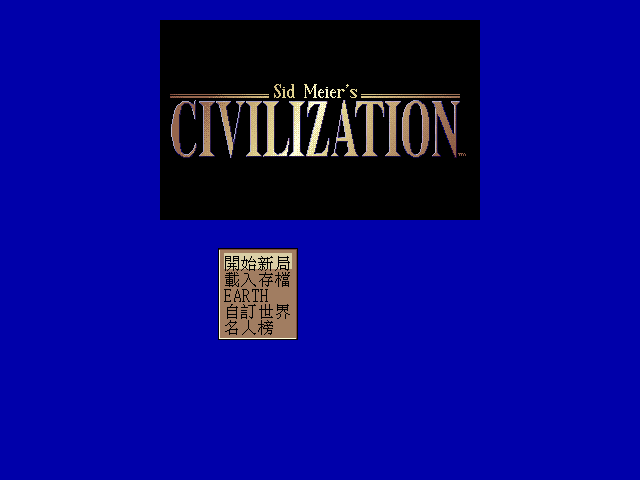
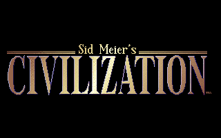
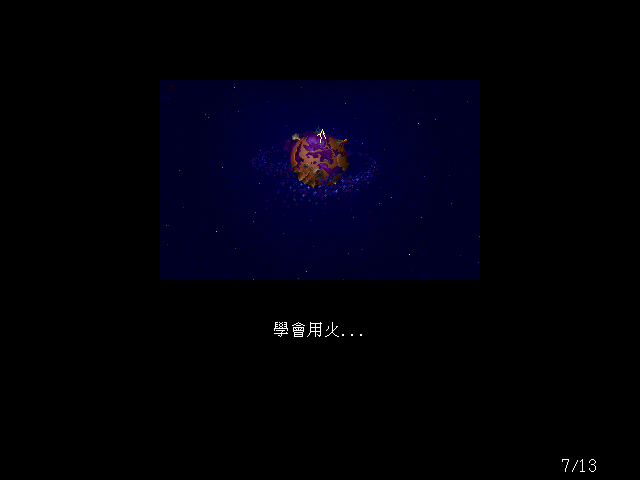
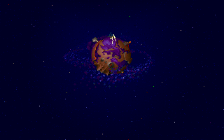
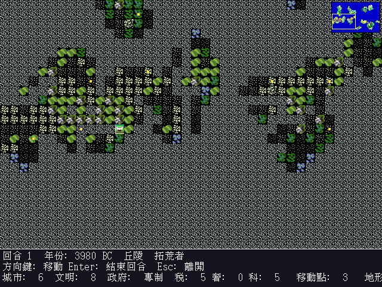
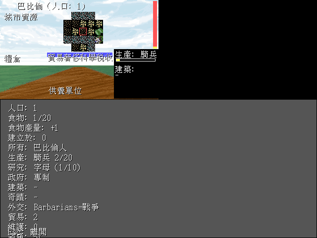
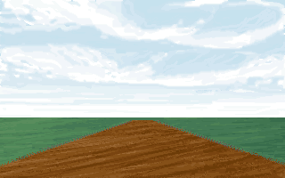
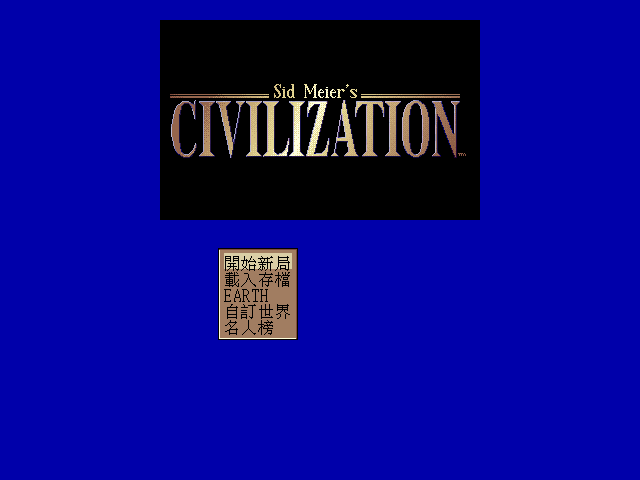

# openciv1pp vs DOS Civ1 — 視覺對照

下表並陳 openciv1pp（C++/SDL2 + 繁體中文化，640x480 原生）與 1991 年原版
DOS Civilization（320x200 VGA）。所有 openciv1pp 截圖皆由 `--shot*`
無頭模式渲染、Translator 開啟、實際載入 DOS `.PIC` 資產；所有 DOS 截圖
皆直接由 PicLoader 解碼原版 `.PIC` 檔得到（未經 DOSBox 中介）。

| openciv1pp (C++/SDL2 + 中文) | DOS Civ1 (1991) |
|---|---|
|  |  |
| 標題畫面：原 LOGO.PIC + 中文主選單，640x480 | 原 LOGO.PIC，320x200 VGA |
|  |  |
| 開場序幕：BIRTH3 (「學會用火...」)，含中文字幕與頁碼 | 原 BIRTH3.PIC 字幕由 INTRO.TXT 提供 |
|  | (動態組合，無單張 DOS 對應) |
| 主遊戲：MiniWorld 真實 TER257 地塊 + 迷你地圖 + 中文 HUD（回合 / 年份 / 地形 / 城市 / 文明 / 政府 / 稅 / 奢 / 科 / 移動點） | openciv1pp 的世界畫面忠實重現 DOS in-game layout |
|  |  |
| 城市畫面：原 CBACK.PIC 透視背景 + 中文資訊面板（人口 / 食物 / 生產 / 研究 / 政府 / 建築 / 奇蹟 / 外交） | 原 CBACK.PIC（DOS 城市畫面背景貼圖） |
|  | (對話框元件，無單張 DOS 對應) |
| MenuBoxDialog：中文化主選單項目（開始新局 / 載入存檔 / EARTH / 自訂世界 / 名人榜 / 離開），高亮列＝索引 11 | DOS 原本為英文 MenuBox；openciv1pp 透過 Translator 局部覆寫 |

openciv1pp 在保留 1991 原版視覺風格（VGA 256 色 palette、原 .PIC 美術、
TER257 真實地塊、CBACK 城市透視背景、MenuBoxDialog 配色）的前提下，
加入完整中文化、640x480 視野擴展、滑鼠支援，並補上太空競賽勝利等
Civ1 完整機制（51 個無頭測試全部綠燈）。
